# 🍜 AIおばあちゃんの作り方 - 初心者でも10分で作れる！RAG搭載チャットボット物語

> **10分で自分だけのRAG搭載AIチャットボットを作成。料理レシピを覚えた「AIおばあちゃん」との会話を通じて、検索拡張生成（RAG）技術を楽しく学べる実践的チュートリアル。**

> 「孫よ、今日はおばあちゃんの秘密のレシピを教えてあげるわ。でも、これは料理のレシピじゃないの。AIのレシピよ。」

## 🎯 この記事で学べること

- ✅ RAG（検索拡張生成）の基本概念と仕組み
- ✅ 実際に動作するRAGシステムの構築方法
- ✅ LangChain + FastAPI + OpenAIを使った実装
- ✅ 自分だけの知識ベースをカスタマイズする方法
- ✅ トラブルシューティングと本格運用のノウハウ

## 📖 目次

### 🚀 クイックスタート（10分コース）
1. [環境構築](#第2章：材料を準備しよう---開発環境構築) → 2分
2. [ベクトルストア作成](#第4章：記憶の魔法---ベクトルストアの秘密) → 3分
3. [サーバー起動](#第7章：魔法の完成---動作確認とカスタマイズ) → 2分
4. [動作確認](#第7章：魔法の完成---動作確認とカスタマイズ) → 3分

### 📚 詳細学習
1. [プロローグ：AIおばあちゃんとの出会い](#プロローグ：AIおばあちゃんとの出会い)
2. [第1章：RAGって何？不思議な技術の正体](#第1章：RAGって何？不思議な技術の正体)
3. [第2章：材料を準備しよう - 開発環境構築](#第2章：材料を準備しよう---開発環境構築)
4. [第3章：知識の種をまく - 知識ベースの構築](#第3章：知識の種をまく---知識ベースの構築)
5. [第4章：記憶の魔法 - ベクトルストアの秘密](#第4章：記憶の魔法---ベクトルストアの秘密)
6. [第5章：会話の心臓 - APIサーバーの実装](#第5章：会話の心臓---APIサーバーの実装)
7. [第6章：美しい顔 - フロントエンドの作成](#第6章：美しい顔---フロントエンドの作成)
8. [第7章：魔法の完成 - 動作確認とカスタマイズ](#第7章：魔法の完成---動作確認とカスタマイズ)
9. [第8章：実践的な活用例](#第8章：実践的な活用例)
10. [第9章：トラブルシューティング](#第9章：トラブルシューティング)
11. [エピローグ：あなたの番です](#エピローグ：あなたの番です)

---

## プロローグ：AIおばあちゃんとの出会い

田中太郎（仮名）は、プログラミングを学び始めたばかりの大学生。「最近AIがすごいって聞くけど、自分でも作れるのかな？」と思っていた矢先、友人から不思議な話を聞いた。

「おばあちゃんの料理レシピを全部覚えてくれるAIがあるんだって！しかも、10分で作れるらしいよ」

興味津々の太郎は、その「AIおばあちゃん」のソースコードを見てみることにした。

```bash
git clone https://github.com/takusaotome/rag-starter-kit.git
cd rag-starter-kit
```

「これが、AIおばあちゃんの設計図...？」

---

## 第1章：RAGって何？不思議な技術の正体

### 🤖 AIおばあちゃんが教える「RAGの基本」

太郎がコードを眺めていると、突然画面の中からやさしい声が聞こえてきた。

「こんにちは、太郎くん。私がAIおばあちゃんよ。今日は、RAGという不思議な技術について教えてあげるわ。」

**RAG（Retrieval-Augmented Generation）**とは、日本語で「検索拡張生成」という意味。簡単に言えば、AIに「記憶帳」を持たせて、より正確で詳しい回答をできるようにする技術です。

### 🧠 普通のAIとRAG搭載AIの違い

**普通のAI（GPT-4など）**
```
質問: "親子丼の作り方教えて"
↓
AI: "一般的な親子丼の作り方は..."
```

**RAG搭載AI（AIおばあちゃん）**
```
質問: "親子丼の作り方教えて"
↓
① 知識ベースから関連情報を検索
② 見つけた情報 + 質問を組み合わせ
③ より正確で詳細な回答を生成
↓
AI: "おばあちゃんの秘伝レシピによると、親子丼の美味しさの秘密は..."
```

### 🔍 RAGの魔法の仕組み

```mermaid
graph TD
    A[ユーザーの質問] --> B[類似度検索]
    B --> C[知識ベース]
    C --> D[関連情報取得]
    D --> E[プロンプト生成]
    E --> F[LLM推論]
    F --> G[回答生成]
```



「つまり、RAGはAIに『専門的な記憶』を持たせる技術なのよ。おばあちゃんの料理レシピを覚えさせれば、料理の専門家になれるの！」

### 💡 なぜRAGが重要なのか？

1. **最新情報への対応** - 学習データに含まれない情報も扱える
2. **専門知識の活用** - 特定分野の深い知識を持たせられる
3. **情報の信頼性** - 参照元が明確で検証可能
4. **カスタマイズ性** - 組織や個人の知識ベースを活用

---

## 第2章：材料を準備しよう - 開発環境構築

### 🛠️ 必要な材料（技術スタック）

AIおばあちゃんのレシピには、以下の材料が必要：

```python
# 🍳 調理器具（メインフレームワーク）
FastAPI      # 高速APIフレームワーク
LangChain    # AI開発フレームワーク
OpenAI       # 大規模言語モデル

# 🧠 記憶装置（ベクトルストア）
FAISS        # 高速類似度検索
OpenAI Embeddings  # テキストのベクトル化

# 🎨 その他の調味料
JWT          # 認証システム
Pydantic     # データ検証
Uvicorn      # ASGIサーバー
```

### 📦 環境構築の手順

#### ⚡ 超高速セットアップ（2分）

```bash
# 1. プロジェクトのダウンロード
git clone https://github.com/takusaotome/rag-starter-kit.git
cd rag-starter-kit

# 2. 仮想環境を作成（料理で言う「清潔な調理場」）
python3 -m venv venv
source venv/bin/activate  # Windowsの場合: venv\Scripts\activate

# 3. 材料を調達（パッケージインストール）
pip install -r requirements.txt

# 4. 秘密の調味料を準備（API Key設定）
export OPENAI_API_KEY="your-api-key-here"
# または .envファイルを作成
echo "OPENAI_API_KEY=your-api-key-here" > .env
```

#### ✅ 動作確認
```bash
# 正常にインストールされたかチェック
python3 -c "import langchain; print('✅ LangChain OK')"
python3 -c "import fastapi; print('✅ FastAPI OK')"
echo $OPENAI_API_KEY | head -c 10 && echo "... ✅ API Key OK"
```

**💡 初心者向けTips**

- **仮想環境って何？**: 料理で例えると「専用の調理場」。他のプロジェクトと材料が混ざらないように隔離する技術
- **API Keyって？**: OpenAIのサービスを使うための「入場券」。[OpenAI公式サイト](https://openai.com/)で取得可能
- **エラーが出た場合**: [トラブルシューティング](#第9章：トラブルシューティング)を参照

---

## 第3章：知識の種をまく - 知識ベースの構築

### 📚 おばあちゃんの知識ベース

太郎は`knowledge`フォルダを覗いてみた。

```bash
ls knowledge/
# 01_basic_rice_dishes.md
# 02_noodle_dishes.md
# 03_grilled_dishes.md
# ...
```

「わあ、本当におばあちゃんのレシピがいっぱい！」

### 🍜 知識ベースの中身を見てみよう

```markdown
# 基本のご飯もの - Basic Rice Dishes

## 親子丼 (Oyakodon - Chicken and Egg Rice Bowl)

### 由来・文化的背景
親子丼は明治時代に東京で生まれた料理で、
鶏肉（親）と卵（子）を使うことから「親子丼」と名付けられました。

### 材料（2人分）
- 鶏もも肉: 200g（一口大にカット）
- 卵: 4個
- 玉ねぎ: 1/2個（薄切り）
...

### 調理のコツ
- **卵は半熟が美味**: 完全に固めず、とろとろの半熟状態で仕上げる
- **火加減が重要**: 強火だと卵が固くなりすぎるので中火で調理
...
```

### 🔧 あなたの知識ベースを作る方法

#### 🎯 5分で知識ベースをカスタマイズ

**Step 1: 既存のファイルを参考にしよう**

```bash
# サンプルレシピを確認
cat knowledge/01_basic_rice_dishes.md
```

**Step 2: 自分の専門分野の知識を追加**

```markdown
# 例: プログラミング知識ベース
## Python基礎

### 変数の宣言
name = "太郎"
age = 20

### 関数の定義
def greet(name):
    return f"こんにちは、{name}さん！"
```

**Step 3: 構造化されたフォーマットを心がけよう**

```markdown
# ✅ 良い例（RAGが理解しやすい）
## 見出し
### 概要
### 詳細手順
### 注意点

# ❌ 悪い例（RAGが混乱する）
適当にテキストを羅列...
```

#### 💡 知識ベース作成のコツ
- **1つのファイルは1つのトピック**に集中
- **見出しは具体的**に（「使い方」→「Pythonでの使い方」）
- **コード例は実際に動作するもの**を記載
- **よくある質問**も含める

---

## 第4章：記憶の魔法 - ベクトルストアの秘密

### 🧠 AIの記憶の仕組み

「太郎くん、AIの記憶って人間とは違うのよ」とAIおばあちゃんが説明してくれた。

**人間の記憶**
- 文字として覚える
- 意味で思い出す
- 曖昧で感情的

**AIの記憶（ベクトルストア）**
- 数値の配列として覚える
- 数学的類似度で検索
- 正確で客観的

### 🔢 ベクトル化の魔法

```python
# 文章がベクトルに変換される様子
"親子丼の作り方" → [0.1, -0.3, 0.8, 0.2, ...]
"鶏肉と卵の料理" → [0.2, -0.2, 0.7, 0.3, ...]
```

類似度の計算：
```python
similarity = cosine_similarity(vector1, vector2)
# 0.85（とても似ている）
```

### 🏗️ ベクトルストアを構築しよう（3分）

```bash
# 知識ベースをベクトル化（このコマンドでAIが料理レシピを記憶します）
python3 run_etl.py
```

#### ✅ 成功メッセージを確認：
```
📚 Processing knowledge files...
✅ Loaded 01_basic_rice_dishes.md (1,234 characters)
✅ Loaded 02_noodle_dishes.md (2,345 characters)
🔄 Creating vector embeddings...
✅ Vector store created successfully!
💾 Saved to vector_store/ directory
```

実行すると、以下のような魔法が起こる：

```python
# ingest.py の中身（簡略版）
def process_documents():
    # 1. マークダウンファイルを読み込み
    documents = load_markdown_files("knowledge/")
    
    # 2. 文章を適切な長さに分割
    text_chunks = split_into_chunks(documents, chunk_size=800)
    
    # 3. 各チャンクをベクトルに変換
    embeddings = OpenAIEmbeddings()
    vectors = embeddings.embed_documents(text_chunks)
    
    # 4. 高速検索可能なインデックスを作成
    vector_store = FAISS.from_documents(text_chunks, embeddings)
    
    # 5. 保存
    vector_store.save_local("vector_store")
```

**💡 初心者向けTips**

- **チャンクって何？**: 長い文章を適切な長さに分割したもの。料理で言うと「一口大に切る」
- **なぜ分割するの？**: AIが理解しやすく、検索精度が向上する
- **ベクトルの次元数**: OpenAIの`text-embedding-3-small`は1536次元（1536個の数値）

---

## 第5章：会話の心臓 - APIサーバーの実装

### 🚀 FastAPIサーバーの構造

```python
# server.py の主要部分
from fastapi import FastAPI, HTTPException, Depends
from langchain.chains import RetrievalQA
from langchain_openai import ChatOpenAI

class RAGServer:
    def __init__(self):
        self.vector_store = None
        self.qa_chain = None
        self.embeddings = OpenAIEmbeddings()
    
    def process_query(self, query: str):
        # 1. 質問を受け取る
        # 2. 関連情報を検索
        # 3. LLMで回答生成
        # 4. 結果を返す
        pass
```

### 🔍 言語検出の魔法

おばあちゃんは多国語対応！

```python
def detect_language(self, text: str) -> str:
    """質問の言語を自動検出"""
    try:
        detected_lang = detect(text)
        if detected_lang == 'ja':
            return 'japanese'
        elif detected_lang == 'en':
            return 'english'
        else:
            return 'english'  # デフォルト
    except:
        return 'english'
```

### 🌊 ストリーミング機能

リアルタイムで回答が流れる仕組み：

```python
async def process_query_streaming(self, query: str):
    """ストリーミング形式で回答を生成"""
    # 言語検出
    language = self.detect_language(query)
    
    # 動的プロンプト生成
    prompt = self.get_dynamic_prompt_template(query)
    
    # ストリーミング開始
    async for chunk in self.streaming_qa_chain.astream({"query": query}):
        yield f"data: {json.dumps({'text': chunk.get('result', '')})}\n\n"
```

### 🔐 認証システム

```python
# JWT認証
def create_access_token(data: dict) -> str:
    to_encode = data.copy()
    expire = datetime.utcnow() + timedelta(hours=24)
    to_encode.update({"exp": expire})
    return jwt.encode(to_encode, Config.JWT_SECRET_KEY, algorithm="HS256")
```

---

## 第6章：美しい顔 - フロントエンドの作成

### 🎨 Tailwind CSSで美しいUI

```html
<!-- RAG_demo.html の抜粋 -->
<div class="min-h-screen bg-gradient-to-br from-blue-50 to-indigo-100">
    <div class="max-w-4xl mx-auto p-6">
        <div class="bg-white rounded-2xl shadow-xl overflow-hidden">
            <div class="bg-gradient-to-r from-indigo-500 to-purple-600 px-8 py-6">
                <h1 class="text-3xl font-bold text-white">
                    🍜 RAG Starter Kit Demo
                </h1>
            </div>
        </div>
    </div>
</div>
```

### ⌨️ キーボードショートカット

```javascript
// Cmd+Enter / Ctrl+Enter でクエリ実行
document.addEventListener('keydown', function(e) {
    if ((e.metaKey || e.ctrlKey) && e.key === 'Enter') {
        e.preventDefault();
        if (!submitButton.disabled) {
            submitQuery();
        }
    }
});
```

### 💫 リアルタイム応答表示

```javascript
// Server-Sent Events でストリーミング
const eventSource = new EventSource('/query/stream', {
    method: 'POST',
    headers: {
        'Authorization': `Bearer ${token}`,
        'Content-Type': 'application/json'
    }
});

eventSource.onmessage = function(event) {
    const data = JSON.parse(event.data);
    responseDiv.innerHTML += data.text;
};
```

---

## 第7章：魔法の完成 - 動作確認とカスタマイズ

### 🎯 AIおばあちゃんを起動してみよう（2分）

#### ⚡ ワンコマンドで起動
```bash
# AIおばあちゃんを起動！
python3 server.py
```

#### ✅ 成功メッセージを確認：
```
🚀 RAG Starter Kit Server starting...
📝 Loading prompt template...
✅ Loaded prompt template
📚 Loading vector store...
✅ Vector store loading completed.
🔗 Setting up QA chain...
✅ QA chain setup completed.
🚀 RAG server initialization completed!
INFO:     Uvicorn running on http://0.0.0.0:8000
```

太郎は、ついに完成したRAGシステムを動かしてみることにした。

「でも、どうやって起動するの？」太郎は少し不安になった。

「大丈夫よ、太郎くん。一歩ずつ進めましょう」AIおばあちゃんが優しく教えてくれた。

### 🌍 ブラウザでアクセス（1分）

#### ⚡ ワンクリックでアクセス
```bash
# デモページを開く
open http://localhost:8000/RAG_demo.html
# またはブラウザで直接アクセス
# http://localhost:8000/RAG_demo.html
```

#### 🔑 ログイン情報（デモ用）
- **ユーザー名**: `admin`
- **パスワード**: `test123`

「太郎くん、サーバーが起動したら、ブラウザで確認してみましょう」

### 🍳 実際に質問してみよう（2分）

#### 📝 テスト用質問例集
```
日本語：
- "親子丼の作り方を教えて"
- "味噌汁の作り方は？"
- "天ぷらを美味しく作るコツは？"

英語：
- "How to make Oyakodon?"
- "What's the secret to crispy tempura?"
- "Give me ideas for bento box dishes"
```

太郎は、ドキドキしながら初めての質問をしてみることにした。

「うまく答えてくれるかな？」

#### 📝 日本語での質問

**質問例：**
```
質問: "親子丼の作り方を教えて"
```

**AIおばあちゃんの回答：**
```
おばあちゃんの秘伝レシピによると、親子丼の美味しさの秘密は、
鶏肉と卵の絶妙なバランスにあります。

📋 材料（2人分）：
- 鶏もも肉 200g
- 卵 4個
- 玉ねぎ 1/2個
- だし汁 200ml
- 醤油 大さじ2
- みりん 大さじ2
- 砂糖 大さじ1

👩‍🍳 作り方：
1. 鶏肉は一口大に切り、玉ねぎは薄切りにします
2. だし汁、醤油、みりん、砂糖を鍋で煮立てます
3. 鶏肉と玉ねぎを加えて5分煮込みます
...
```

**💡 ここで何が起こっているの？**
1. 質問が日本語で入力される
2. システムが日本語を検出
3. ベクトルストアから関連する料理情報を検索
4. 日本語のプロンプトでGPT-4oに質問
5. 日本語で自然な回答を生成

### 🎨 カスタマイズしてみよう

「太郎くん、基本的なRAGシステムができたら、次は自分だけの特別なアシスタントを作ってみましょう」

AIおばあちゃんは、太郎に更なる可能性を見せてくれた。

#### 📚 1. 自分の知識ベースに変更

**🎯 なぜカスタマイズが必要？**
- 料理以外の分野（勉強、仕事、趣味）でも使えるようにする
- 自分専用の情報を追加して、より個人的なアシスタントを作る
- 会社や学校の資料を活用して、業務効率を上げる

**🔄 手順1：既存データの削除**
```bash
# 既存のレシピを削除（バックアップ推奨）
cp -r knowledge/ knowledge_backup/
rm knowledge/*.md
```

**📝 手順2：新しい知識を追加**
```bash
# 自分の知識を追加
echo "# My Knowledge Base" > knowledge/my_knowledge.md
```

**🎨 実際の例：**

**勉強用のアシスタント**
```markdown
# knowledge/study_notes.md
## 数学の基礎
### 二次方程式の解法
ax² + bx + c = 0 の形の方程式は、因数分解、公式、グラフの方法で解けます。

判別式 D = b² - 4ac により、解の個数が決まります：
- D > 0：異なる2つの実数解
- D = 0：重解（1つの実数解）
- D < 0：2つの複素数解

### 三角関数の基本
sin, cos, tan の関係と、加法定理、倍角公式を覚えましょう。
```

---

# 🚀 ここからが本番！応用編

## 第8章：実践的な活用例

「太郎くん、RAGシステムは料理だけじゃなくて、いろんな分野で活用できるのよ」

AIおばあちゃんは、太郎に様々な活用例を見せてくれた。

### 💼 ビジネスでの活用

#### 🏢 1. 社内FAQ システム

**🎯 なぜ社内FAQが必要？**
- 従業員の質問対応時間を90%短縮
- 人事部門への問い合わせ件数を大幅削減
- 新入社員の自立を促進
- 24時間365日いつでも回答可能

**📝 実装手順：**

**ステップ1：FAQデータの作成**
```markdown
# knowledge/company_faq.md
## 有給休暇の取得方法
### 申請手順
1. 社内システムにログイン
2. 休暇申請フォームを入力
3. 上司に承認依頼
4. 承認後、人事に自動通知

### 有給日数の確認
- 1年目：10日間
- 2年目：11日間
- 3年目以降：年間20日間まで

### 緊急時の対応
急病の場合は、事後申請も可能です。
```

### 🎓 教育での活用

#### 📚 1. 学習支援システム

**🎯 なぜ学習支援AIが有効？**
- 個人のペースに合わせた学習が可能
- 24時間いつでも質問できる
- 繰り返し学習で理解度を向上
- 苦手分野の集中的な学習をサポート

---

## 第9章：トラブルシューティング

「太郎くん、どんなシステムでも問題は発生するもの。大切なのは、問題を素早く見つけて解決することよ」

AIおばあちゃんは、太郎に実践的なトラブルシューティングの方法を教えてくれた。

### 🐛 よくある問題と解決法

#### 🔍 1. ModuleNotFoundError

**🚨 エラー例：**
```bash
ModuleNotFoundError: No module named 'langchain'
ModuleNotFoundError: No module named 'langdetect'
```

**💡 原因：**
- 仮想環境が正しく有効化されていない
- 必要なライブラリがインストールされていない
- Pythonのパスが間違っている

**🔧 解決法：**

**ステップ1：環境の確認**
```bash
# 仮想環境の確認
which python
# 期待される出力：/path/to/venv/bin/python

# インストール済みパッケージの確認
pip list | grep langchain
pip list | grep langdetect
```

**ステップ2：仮想環境の再有効化**
```bash
# 仮想環境を無効化
deactivate

# 再度有効化
source venv/bin/activate  # Linux/Mac
# または
venv\Scripts\activate     # Windows

# 確認
echo $VIRTUAL_ENV
```

**ステップ3：パッケージの再インストール**
```bash
# 全パッケージの再インストール
pip install -r requirements.txt

# 個別インストール
pip install langchain langdetect fastapi uvicorn
```

#### 🔑 2. OpenAI API エラー

**🚨 エラー例：**
```bash
openai.error.RateLimitError: Rate limit exceeded
openai.error.InvalidRequestError: Invalid API key
openai.error.AuthenticationError: Incorrect API key
```

**🔧 解決法：**

**ステップ1：APIキーの確認**
```bash
# 環境変数の確認
echo $OPENAI_API_KEY

# .envファイルの確認
cat .env | grep OPENAI_API_KEY
```

**ステップ2：API制限の確認**
```python
# API制限の詳細確認
import openai
from datetime import datetime

try:
    response = openai.ChatCompletion.create(
        model="gpt-3.5-turbo",
        messages=[{"role": "user", "content": "Hello"}],
        max_tokens=10
    )
    print("API接続OK")
except openai.error.RateLimitError as e:
    print(f"レート制限エラー: {e}")
    print("しばらく待ってから再試行してください")
except openai.error.AuthenticationError as e:
    print(f"認証エラー: {e}")
    print("APIキーを確認してください")
except Exception as e:
    print(f"その他のエラー: {e}")
```

---

## エピローグ：あなたの番です

### 🎉 おめでとう！

太郎は、ついに自分だけの「AIおばあちゃん」を作ることができた。

「すごいじゃない、太郎くん！」AIおばあちゃんが微笑んだ。「これで、あなたも立派なRAGエンジニアね。」

### 🌟 次のステップ

**1. 自分だけの知識ベースを作る**
- 趣味の知識（音楽、スポーツ、ゲーム）
- 仕事の知識（業界情報、技術文書）
- 学習ノート（授業内容、参考書の要約）

**2. 機能を拡張する**
- 画像認識機能の追加
- 音声入力対応
- 多言語対応の強化
- スマートフォンアプリ化

**3. コミュニティに参加する**
- GitHub でコードを公開
- ブログで学習記録を発信
- 勉強会やハッカソンに参加

### 💝 最後に

RAGは、AIに「専門知識」を持たせる魔法の技術。でも、本当の魔法は、あなた自身の創造力とアイデア。

今日学んだことを活かして、世界をちょっと便利にする、あなただけのAIアシスタントを作ってみてください。

**「さあ、あなたの番よ。どんなAIアシスタントを作るの？」**

---

## 🎯 まとめ - 10分で学んだこと

### ✅ 完了チェックリスト
- [ ] RAGの基本概念を理解
- [ ] 開発環境の構築完了
- [ ] ベクトルストアの作成完了
- [ ] AIチャットボットの動作確認完了
- [ ] カスタマイズ方法を理解
- [ ] トラブルシューティング方法を把握

### 🚀 次に学ぶべきこと
1. **LangChainの深い理解** - より高度な機能の活用
2. **ベクトルデータベース** - ChromaDB、Pineconeなど
3. **プロンプトエンジニアリング** - より効果的な指示方法
4. **本格的なデプロイ** - DockerやAWSを使った運用

### 🔗 学習リソース
- [LangChain公式ドキュメント](https://python.langchain.com/)
- [OpenAI API リファレンス](https://platform.openai.com/docs)
- [RAG Starter Kit GitHub](https://github.com/takusaotome/rag-starter-kit)

---

## 🏷️ タグ

`#RAG` `#AI` `#ChatBot` `#Python` `#FastAPI` `#LangChain` `#OpenAI` `#初心者` `#チュートリアル` `#機械学習` `#自然言語処理` `#ベクトル検索` `#知識ベース` `#プログラミング学習` `#10分チュートリアル` `#実践的`

---

*この記事が役に立ったら、ぜひ⭐をつけて、友達にもシェアしてください！*

**🚀 [RAG Starter Kit をGitHubで見る](https://github.com/takusaotome/rag-starter-kit)**

---

*最終更新日: 2025年7月*  
*執筆者: AI と人間のコラボレーション*  
*ライセンス: MIT License*  
*テスト環境: Python 3.11, OpenAI GPT-4o, LangChain 0.2.0*