# 🍜 AIおばあちゃんの作り方 - 初心者でも10分で作れる！RAG搭載チャットボット物語

> **10分で自分だけのRAG搭載AIチャットボットを作成。料理レシピを覚えた「AIおばあちゃん」との会話を通じて、検索拡張生成（RAG）技術を楽しく学べる実践的チュートリアル。**

> 「孫よ、今日はおばあちゃんの秘密のレシピを教えてあげるわ。でも、これは料理のレシピじゃないの。AIのレシピよ。」

## 🎯 この記事で学べること

- ✅ RAG（検索拡張生成）の基本概念と仕組み
- ✅ 実際に動作するRAGシステムの構築方法
- ✅ LangChain + FastAPI + OpenAIを使った実装
- ✅ 自分だけの知識ベースをカスタマイズする方法
- ✅ トラブルシューティングと本格運用のノウハウ

## 📖 目次

### 🚀 クイックスタート（10分コース）
1. [環境構築](#chapter2) → 2分
2. [ベクトルストア作成](#chapter4) → 3分
3. [サーバー起動](#chapter7) → 2分
4. [動作確認](#chapter7) → 3分

### 📚 詳細学習
1. [プロローグ：AIおばあちゃんとの出会い](#prologue)
2. [第1章：RAGって何？不思議な技術の正体](#chapter1)
3. [第2章：材料を準備しよう - 開発環境構築](#chapter2)
4. [第3章：知識の種をまく - 知識ベースの構築](#chapter3)
5. [第4章：記憶の魔法 - ベクトルストアの秘密](#chapter4)
6. [第5章：会話の心臓 - APIサーバーの実装](#chapter5)
7. [第6章：美しい顔 - フロントエンドの作成](#chapter6)
8. [第7章：魔法の完成 - 動作確認とカスタマイズ](#chapter7)
9. [第8章：実践的な活用例](#chapter8)
10. [第9章：トラブルシューティング](#chapter9)
11. [エピローグ：あなたの番です](#epilogue)

---

## プロローグ：AIおばあちゃんとの出会い {#prologue}

田中太郎（仮名）は、プログラミングを学び始めたばかりの大学生。「最近AIがすごいって聞くけど、自分でも作れるのかな？」と思っていた矢先、友人から不思議な話を聞いた。

「おばあちゃんの料理レシピを全部覚えてくれるAIがあるんだって！しかも、10分で作れるらしいよ」

興味津々の太郎は、その「AIおばあちゃん」のソースコードを見てみることにした。

```bash
git clone https://github.com/takusaotome/rag-starter-kit.git
cd rag-starter-kit
```

「これが、AIおばあちゃんの設計図...？」

---

## 第1章：RAGって何？不思議な技術の正体 {#chapter1}

### 🤖 AIおばあちゃんが教える「RAGの基本」

太郎がコードを眺めていると、突然画面の中からやさしい声が聞こえてきた。

「こんにちは、太郎くん。私がAIおばあちゃんよ。今日は、RAGという不思議な技術について教えてあげるわ。」

**RAG（Retrieval-Augmented Generation）**とは、日本語で「検索拡張生成」という意味。簡単に言えば、AIに「記憶帳」を持たせて、より正確で詳しい回答をできるようにする技術です。

### 🧠 普通のAIとRAG搭載AIの違い

**普通のAI（GPT-4など）**
```
質問: "親子丼の作り方教えて"
↓
AI: "一般的な親子丼の作り方は..."
```

**RAG搭載AI（AIおばあちゃん）**
```
質問: "親子丼の作り方教えて"
↓
① 知識ベースから関連情報を検索
② 見つけた情報 + 質問を組み合わせ
③ より正確で詳細な回答を生成
↓
AI: "おばあちゃんの秘伝レシピによると、親子丼の美味しさの秘密は..."
```

### 🔍 RAGの魔法の仕組み

```mermaid
graph TD
    A[ユーザーの質問] --> B[類似度検索]
    B --> C[知識ベース]
    C --> D[関連情報取得]
    D --> E[プロンプト生成]
    E --> F[LLM推論]
    F --> G[回答生成]
```



「つまり、RAGはAIに『専門的な記憶』を持たせる技術なのよ。おばあちゃんの料理レシピを覚えさせれば、料理の専門家になれるの！」

### 💡 なぜRAGが重要なのか？

1. **最新情報への対応** - 学習データに含まれない情報も扱える
2. **専門知識の活用** - 特定分野の深い知識を持たせられる
3. **情報の信頼性** - 参照元が明確で検証可能
4. **カスタマイズ性** - 組織や個人の知識ベースを活用

---

## 第2章：材料を準備しよう - 開発環境構築 {#chapter2}

### 🛠️ 必要な材料（技術スタック）

AIおばあちゃんのレシピには、以下の材料が必要：

```python
# 🍳 調理器具（メインフレームワーク）
FastAPI      # 高速APIフレームワーク
LangChain    # AI開発フレームワーク
OpenAI       # 大規模言語モデル

# 🧠 記憶装置（ベクトルストア）
FAISS        # 高速類似度検索
OpenAI Embeddings  # テキストのベクトル化

# 🎨 その他の調味料
JWT          # 認証システム
Pydantic     # データ検証
Uvicorn      # ASGIサーバー
```

### 📦 環境構築の手順

#### ⚡ 超高速セットアップ（2分）

```bash
# 1. プロジェクトのダウンロード
git clone https://github.com/takusaotome/rag-starter-kit.git
cd rag-starter-kit

# 2. 仮想環境を作成（料理で言う「清潔な調理場」）
python3 -m venv venv
source venv/bin/activate  # Windowsの場合: venv\Scripts\activate

# 3. 材料を調達（パッケージインストール）
pip install -r requirements.txt

# 4. 秘密の調味料を準備（API Key設定）
export OPENAI_API_KEY="your-api-key-here"
# または .envファイルを作成
echo "OPENAI_API_KEY=your-api-key-here" > .env
```

#### ✅ 動作確認
```bash
# 正常にインストールされたかチェック
python3 -c "import langchain; print('✅ LangChain OK')"
python3 -c "import fastapi; print('✅ FastAPI OK')"
echo $OPENAI_API_KEY | head -c 10 && echo "... ✅ API Key OK"
```

**💡 初心者向けTips**

- **仮想環境って何？**: 料理で例えると「専用の調理場」。他のプロジェクトと材料が混ざらないように隔離する技術
- **API Keyって？**: OpenAIのサービスを使うための「入場券」。[OpenAI公式サイト](https://openai.com/)で取得可能
- **エラーが出た場合**: [トラブルシューティング](#第9章：トラブルシューティング)を参照

---

## 第3章：知識の種をまく - 知識ベースの構築 {#chapter3}

### 📚 おばあちゃんの知識ベース

太郎は`knowledge`フォルダを覗いてみた。

```bash
ls knowledge/
# 01_basic_rice_dishes.md
# 02_noodle_dishes.md
# 03_grilled_dishes.md
# ...
```

「わあ、本当におばあちゃんのレシピがいっぱい！」

### 🍜 知識ベースの中身を見てみよう

```markdown
# 基本のご飯もの - Basic Rice Dishes

## 親子丼 (Oyakodon - Chicken and Egg Rice Bowl)

### 由来・文化的背景
親子丼は明治時代に東京で生まれた料理で、
鶏肉（親）と卵（子）を使うことから「親子丼」と名付けられました。

### 材料（2人分）
- 鶏もも肉: 200g（一口大にカット）
- 卵: 4個
- 玉ねぎ: 1/2個（薄切り）
...

### 調理のコツ
- **卵は半熟が美味**: 完全に固めず、とろとろの半熟状態で仕上げる
- **火加減が重要**: 強火だと卵が固くなりすぎるので中火で調理
...
```

### 🔧 あなたの知識ベースを作る方法

#### 🎯 5分で知識ベースをカスタマイズ

**Step 1: 既存のファイルを参考にしよう**

```bash
# サンプルレシピを確認
cat knowledge/01_basic_rice_dishes.md
```

**Step 2: 自分の専門分野の知識を追加**

```markdown
# 例: プログラミング知識ベース
## Python基礎

### 変数の宣言
name = "太郎"
age = 20

### 関数の定義
def greet(name):
    return f"こんにちは、{name}さん！"
```

**Step 3: 構造化されたフォーマットを心がけよう**

```markdown
# ✅ 良い例（RAGが理解しやすい）
## 見出し
### 概要
### 詳細手順
### 注意点

# ❌ 悪い例（RAGが混乱する）
適当にテキストを羅列...
```

#### 💡 知識ベース作成のコツ
- **1つのファイルは1つのトピック**に集中
- **見出しは具体的**に（「使い方」→「Pythonでの使い方」）
- **コード例は実際に動作するもの**を記載
- **よくある質問**も含める

---

## 第4章：記憶の魔法 - ベクトルストアの秘密 {#chapter4}

### 🧠 AIの記憶の仕組み

「太郎くん、AIの記憶って人間とは違うのよ」とAIおばあちゃんが説明してくれた。

**人間の記憶**
- 文字として覚える
- 意味で思い出す
- 曖昧で感情的

**AIの記憶（ベクトルストア）**
- 数値の配列として覚える
- 数学的類似度で検索
- 正確で客観的

### 🔢 ベクトル化の魔法

```python
# 文章がベクトルに変換される様子
"親子丼の作り方" → [0.1, -0.3, 0.8, 0.2, ...]
"鶏肉と卵の料理" → [0.2, -0.2, 0.7, 0.3, ...]
```

類似度の計算：
```python
similarity = cosine_similarity(vector1, vector2)
# 0.85（とても似ている）
```

### 🏗️ ベクトルストアを構築しよう（3分）

```bash
# 知識ベースをベクトル化（このコマンドでAIが料理レシピを記憶します）
python3 run_etl.py
```

#### ✅ 成功メッセージを確認：
```
📚 Processing knowledge files...
✅ Loaded 01_basic_rice_dishes.md (1,234 characters)
✅ Loaded 02_noodle_dishes.md (2,345 characters)
🔄 Creating vector embeddings...
✅ Vector store created successfully!
💾 Saved to vector_store/ directory
```

実行すると、以下のような魔法が起こる：

```python
# ingest.py の中身（簡略版）
def process_documents():
    # 1. マークダウンファイルを読み込み
    documents = load_markdown_files("knowledge/")
    
    # 2. 文章を適切な長さに分割
    text_chunks = split_into_chunks(documents, chunk_size=800)
    
    # 3. 各チャンクをベクトルに変換
    embeddings = OpenAIEmbeddings()
    vectors = embeddings.embed_documents(text_chunks)
    
    # 4. 高速検索可能なインデックスを作成
    vector_store = FAISS.from_documents(text_chunks, embeddings)
    
    # 5. 保存
    vector_store.save_local("vector_store")
```

**💡 初心者向けTips**

- **チャンクって何？**: 長い文章を適切な長さに分割したもの。料理で言うと「一口大に切る」
- **なぜ分割するの？**: AIが理解しやすく、検索精度が向上する
- **ベクトルの次元数**: OpenAIの`text-embedding-3-small`は1536次元（1536個の数値）

---

## 第5章：会話の心臓 - APIサーバーの実装 {#chapter5}

「太郎くん、いよいよAIおばあちゃんの心臓部分を作っていきましょう」

太郎は少し緊張した。「サーバーって聞くと難しそう...」

「大丈夫よ。レストランで例えると、お客さん（フロントエンド）から注文（質問）を受けて、シェフ（AI）に伝えて、料理（回答）を運ぶウェイター（APIサーバー）のようなものよ」

### 📚 初学者のための基礎知識

#### 🤔 「APIサーバー」って何？

**API**とは「Application Programming Interface」の略で、簡単に言うと「プログラム同士の会話のルール」です。

```
👤 ユーザー → 🌐 Webページ → 📡 APIサーバー → 🤖 AI → 💬 回答
```

**身近な例で理解しよう：**
- **レストランの注文システム**: お客さん→ウェイター→キッチン→料理→お客さん
- **銀行のATM**: あなた→ATM画面→銀行システム→残高情報→ATM画面
- **AIおばあちゃん**: あなた→Webページ→APIサーバー→AI→回答→Webページ

#### 🔧 「FastAPI」を選ぶ理由

**FastAPI**は、Pythonで作られたWebサーバーフレームワークです。

```python
# 他のフレームワークとの比較（初心者向け）

# Flask（シンプルだが機能が少ない）
@app.route('/hello')
def hello():
    return "Hello World"

# Django（多機能だが複雑）
# 設定ファイル多数、学習コストが高い

# FastAPI（ちょうどいい！）
@app.get("/hello")
async def hello():
    return {"message": "Hello World"}
```

**FastAPIの魅力：**
- 📝 **自動ドキュメント生成** → コードを書くだけでAPI説明書ができる
- ⚡ **高速** → PythonのWebフレームワークの中で最速クラス
- 🔒 **型チェック** → バグを事前に発見できる
- 📱 **簡単** → 少ないコードで多機能を実現

### 🚀 FastAPIサーバーの構造解説

#### 🔍 全体の設計図を理解しよう

```python
# server.py の主要部分（初学者向け詳細解説）

# 📦 必要なライブラリをインポート
from fastapi import FastAPI, HTTPException, Depends  # Webサーバー機能
from langchain.chains import RetrievalQA             # RAG処理の中核
from langchain_openai import ChatOpenAI              # OpenAI GPTとの接続

class RAGServer:
    """
    🧠 AIおばあちゃんの脳みそクラス
    
    このクラスが行うこと：
    - 質問を受け取る
    - 関連する料理レシピを探す
    - AIに質問と情報を渡す
    - 回答を整形して返す
    """
    
    def __init__(self):
        """🎯 初期化：AIおばあちゃんの準備をする"""
        self.vector_store = None      # 📚 レシピの記憶庫（後で設定）
        self.qa_chain = None          # 🔗 質問→回答の処理チェーン
        self.embeddings = OpenAIEmbeddings()  # 🔢 文章をベクトルに変換する道具
    
    def process_query(self, query: str):
        """
        🍳 メインの料理メソッド：質問から回答を作る
        
        【処理の流れ（料理に例えると）】
        1. 何語で話しているか確認（客の言語チェック）
        2. 材料を探す（レシピデータベース検索）
        3. 材料を整理（情報をまとめる）
        4. 調理方法を決める（プロンプト作成）
        5. 料理する（AI推論）
        6. 盛り付け（回答の整形）
        """
        try:
            # 🌍 ステップ1: この質問は日本語？英語？
            language = self.detect_language(query)
            # 📝 ログに記録（デバッグ時に便利）
            logging.info(f"検出言語: {language} | 質問: {query[:50]}...")
            
            # 🔍 ステップ2: 関連するレシピ情報を探索
            # 例：「親子丼」→ 親子丼レシピ、鶏肉料理、卵料理などを検索
            relevant_docs = self.vector_store.similarity_search(
                query,           # 検索クエリ（ユーザーの質問）
                k=4             # 上位4件だけ取得（多すぎると混乱する）
            )
            logging.info(f"関連文書数: {len(relevant_docs)}")
            
            # 📋 ステップ3: 見つけた情報をまとめる
            # 複数のレシピ情報を1つの文章に結合
            context = "\n\n".join([doc.page_content for doc in relevant_docs])
            
            # 🎯 ステップ4: AIへの指示書（プロンプト）を作成
            # 質問の種類に応じて最適な指示を選択
            prompt_template = self.get_dynamic_prompt_template(query)
            final_prompt = prompt_template.format(
                context=context,     # 見つけたレシピ情報
                question=query       # ユーザーの質問
            )
            
            # 🤖 ステップ5: AIに推論してもらう
            # LangChainが質問と情報をGPTに送って回答をもらう
            response = self.qa_chain.run({
                "input_documents": relevant_docs,  # 参考文書
                "question": query                  # 質問
            })
            
            # ✨ ステップ6: 回答を読みやすく整形
            # 言語に応じて敬語や絵文字を追加
            formatted_response = self.format_response(response, language)
            
            # 📊 処理完了をログに記録
            logging.info(f"回答生成完了: {len(formatted_response)}文字")
            return formatted_response
            
        except Exception as e:
            # 🚨 エラーが発生した場合の対処
            logging.error(f"クエリ処理エラー: {str(e)}")
            return self.get_error_response(language)
```

#### 💡 初学者向け：このコードの重要ポイント

**🤔 なぜ`try-except`を使うの？**
```python
try:
    # 普通の処理
    result = process_something()
except Exception as e:
    # エラーが起きた時の処理
    return "エラーが発生しました"
```
プログラムは時々失敗します（ネットワークエラー、API制限など）。`try-except`は「もしエラーが起きても、プログラムを止めずに適切に対処する」ための仕組みです。

**🔍 `similarity_search`の魔法**
```python
# ユーザーが「親子丼の作り方」と質問すると...
query = "親子丼の作り方"

# AIが自動で関連情報を見つけてくれる
results = [
    "親子丼のレシピ情報",      # 最も関連度が高い
    "鶏肉の調理法",           # 2番目
    "卵の調理法",             # 3番目
    "どんぶり料理の基本"      # 4番目
]
```

**📝 `logging`でデバッグ**
```python
logging.info("何が起こっているかを記録")
# → 2024-01-15 10:30:15 - INFO - 何が起こっているかを記録
```
これは「プログラムの日記」のようなもの。何が起こったかを記録して、問題が起きた時に原因を探せます。

### 🔍 言語検出の魔法

おばあちゃんは多国語対応！

```python
def detect_language(self, text: str) -> str:
    """質問の言語を自動検出"""
    try:
        detected_lang = detect(text)
        if detected_lang == 'ja':
            return 'japanese'
        elif detected_lang == 'en':
            return 'english'
        else:
            return 'english'  # デフォルト
    except:
        return 'english'
```

### 🌊 ストリーミング機能

リアルタイムで回答が流れる仕組み：

```python
async def process_query_streaming(self, query: str):
    """ストリーミング形式で回答を生成"""
    # 言語検出
    language = self.detect_language(query)
    
    # 動的プロンプト生成
    prompt = self.get_dynamic_prompt_template(query)
    
    # ストリーミング開始
    async for chunk in self.streaming_qa_chain.astream({"query": query}):
        yield f"data: {json.dumps({'text': chunk.get('result', '')})}\n\n"
```

### 🧠 動的プロンプト生成の仕組み

```python
def get_dynamic_prompt_template(self, query: str) -> str:
    """
    質問の内容に応じて最適なプロンプトテンプレートを選択
    """
    # 料理関連のキーワード検出
    cooking_keywords = ['作り方', '材料', 'レシピ', 'how to make', 'ingredients']
    
    if any(keyword in query.lower() for keyword in cooking_keywords):
        return """
あなたは料理の専門家です。以下のレシピ情報を参考に、具体的で実用的な回答をしてください。

レシピ情報:
{context}

質問: {question}

回答は以下の形式で：
📋 材料
👩‍🍳 作り方
💡 コツ・ポイント
"""
    else:
        return """
以下の情報を参考に、質問に正確に答えてください：

参考情報:
{context}

質問: {question}
"""

def format_response(self, response: str, language: str) -> str:
    """
    回答を言語と形式に応じて整形
    """
    if language == 'japanese':
        # 日本語の場合、敬語や絵文字を追加
        if not response.startswith('申し訳'):
            response = f"🍜 おばあちゃんからのアドバイス\n\n{response}"
    
    return response

def get_error_response(self, language: str) -> str:
    """
    エラー時の適切なレスポンス
    """
    if language == 'japanese':
        return "申し訳ございません。少し調子が悪いようです。もう一度お試しください。"
    else:
        return "I'm sorry, something went wrong. Please try again."
```

### 🔐 認証システム

```python
# JWT認証の完全実装
class AuthManager:
    def __init__(self):
        self.secret_key = Config.JWT_SECRET_KEY
        self.algorithm = "HS256"
        self.access_token_expire = timedelta(hours=24)
    
    def create_access_token(self, data: dict) -> str:
        """アクセストークンを生成"""
        to_encode = data.copy()
        expire = datetime.utcnow() + self.access_token_expire
        to_encode.update({"exp": expire})
        
        try:
            token = jwt.encode(to_encode, self.secret_key, algorithm=self.algorithm)
            logging.info(f"トークン生成成功: ユーザー {data.get('sub', 'unknown')}")
            return token
        except Exception as e:
            logging.error(f"トークン生成エラー: {str(e)}")
            raise HTTPException(status_code=500, detail="トークン生成に失敗しました")
    
    def verify_token(self, token: str) -> dict:
        """トークンを検証してペイロードを返す"""
        try:
            payload = jwt.decode(token, self.secret_key, algorithms=[self.algorithm])
            username: str = payload.get("sub")
            if username is None:
                raise HTTPException(status_code=401, detail="無効なトークンです")
            return payload
        except jwt.ExpiredSignatureError:
            raise HTTPException(status_code=401, detail="トークンが期限切れです")
        except jwt.JWTError:
            raise HTTPException(status_code=401, detail="トークンが無効です")

# 依存性注入でトークン検証
async def get_current_user(token: str = Depends(oauth2_scheme)):
    """現在のユーザーを取得"""
    auth_manager = AuthManager()
    return auth_manager.verify_token(token)
```

### 📊 ログ出力とモニタリング

```python
import logging
from datetime import datetime

# 詳細なログ設定
def setup_logging():
    """ログ設定の初期化"""
    logging.basicConfig(
        level=logging.INFO,
        format='%(asctime)s - %(name)s - %(levelname)s - %(message)s',
        handlers=[
            logging.FileHandler('rag_server.log'),
            logging.StreamHandler()
        ]
    )

class QueryLogger:
    """クエリ処理のログを詳細に記録"""
    
    @staticmethod
    def log_query_start(query: str, user_id: str = None):
        logging.info(f"🔍 クエリ開始 | ユーザー: {user_id} | 質問: {query[:100]}...")
    
    @staticmethod
    def log_vector_search(query: str, results_count: int, search_time: float):
        logging.info(f"🔍 ベクトル検索完了 | 結果数: {results_count} | 検索時間: {search_time:.2f}秒")
    
    @staticmethod
    def log_llm_response(response_length: int, processing_time: float):
        logging.info(f"🤖 LLM応答完了 | 文字数: {response_length} | 処理時間: {processing_time:.2f}秒")
    
    @staticmethod
    def log_error(error: str, query: str):
        logging.error(f"❌ エラー発生 | 質問: {query[:50]} | エラー: {error}")
```

---

## 第6章：美しい顔 - フロントエンドの作成 {#chapter6}

「太郎くん、今度はAIおばあちゃんの顔を作りましょう」

太郎は首をかしげた。「顔？」

「そう、フロントエンドよ。ユーザーが実際に見て触る部分。美しくて使いやすいインターフェースを作るの。料理で言うと『盛り付け』ね」

### 📚 初学者のための基礎知識

#### 🤔 「フロントエンド」って何？

**フロントエンド**とは、ユーザーが直接見て操作する部分のことです。

```
🖥️ フロントエンド（見える部分）
├── HTML → 骨格（建物の構造）
├── CSS  → 見た目（インテリア装飾）
└── JavaScript → 動き（電気設備）

📡 バックエンド（見えない部分）
├── サーバー → 脳みそ（処理をする）
├── データベース → 記憶（情報を保存）
└── API → 橋渡し（やり取りの仕組み）
```

**身近な例で理解：**
- **レストラン**: 客席（フロント）← → 厨房（バック）
- **銀行**: ATM画面（フロント）← → 銀行システム（バック）
- **スマホアプリ**: アプリ画面（フロント）← → サーバー（バック）

#### 🎨 「Tailwind CSS」を選ぶ理由

**CSS**は見た目を作る言語ですが、**Tailwind CSS**はより簡単にきれいなデザインを作れるツールです。

```html
<!-- 普通のCSS（面倒） -->
<style>
.button {
    background-color: blue;
    color: white;
    padding: 10px 20px;
    border-radius: 5px;
    border: none;
}
</style>
<button class="button">クリック</button>

<!-- Tailwind CSS（簡単！） -->
<button class="bg-blue-500 text-white px-5 py-2 rounded border-none">
    クリック
</button>
```

**Tailwindの魅力：**
- 🚀 **書きやすい** → HTMLに直接スタイルを書ける
- 🎨 **美しい** → プロ並みのデザインが簡単に
- 📱 **レスポンシブ** → スマホ・タブレット対応が楽
- ⚡ **高速** → 必要な部分だけを読み込む

### 🎨 Tailwind CSSで美しいUI作り

#### 🏗️ 基本構造の理解

```html
<!-- RAG_demo.html の抜粋（初学者向け解説付き） -->

<!-- 🏠 メインコンテナ：ページ全体の背景を作る -->
<div class="min-h-screen bg-gradient-to-br from-blue-50 to-indigo-100">
    <!-- 📏 コンテンツ幅制限：中央寄せで読みやすくする -->
    <div class="max-w-4xl mx-auto p-6">
        <!-- 💳 カード風デザイン：内容をきれいにまとめる -->
        <div class="bg-white rounded-2xl shadow-xl overflow-hidden">
            <!-- 🎨 ヘッダー部分：グラデーション背景で目立たせる -->
            <div class="bg-gradient-to-r from-indigo-500 to-purple-600 px-8 py-6">
                <h1 class="text-3xl font-bold text-white">
                    🍜 RAG Starter Kit Demo
                </h1>
            </div>
        </div>
    </div>
</div>
```

#### 💡 Tailwind CSSクラス名の意味解説

**🏠 レイアウト関連**
```css
min-h-screen    → 最小高さを画面全体に（スマホでも縦いっぱい）
max-w-4xl      → 最大幅を制限（読みやすい幅にする）
mx-auto        → 左右中央寄せ（m=margin, x=水平, auto=自動）
p-6            → 内側の余白を6単位（p=padding）
```

**🎨 見た目関連**
```css
bg-white                    → 背景色を白に
bg-gradient-to-br          → 右下向きのグラデーション
from-blue-50 to-indigo-100 → 薄い青から薄い紫へ
rounded-2xl                → 角を大きく丸く
shadow-xl                  → 大きな影をつける
```

**📝 文字関連**
```css
text-3xl       → 文字サイズを大きく（3XLサイズ）
font-bold      → 文字を太く
text-white     → 文字色を白に
```

### ⌨️ キーボードショートカットの魔法

#### 🎯 なぜキーボードショートカットが重要？

ユーザーは「マウスでボタンを押す」より「キーボードで素早く操作」を好みます。

```javascript
// 🚀 Cmd+Enter / Ctrl+Enter でクエリ実行（初学者向け解説）

document.addEventListener('keydown', function(e) {
    // 🔍 解説：「キーが押された時」を監視
    
    // Macでは「Cmd」、WindowsでSは「Ctrl」キーをチェック
    if ((e.metaKey || e.ctrlKey) && e.key === 'Enter') {
        // 🛑 ブラウザのデフォルト動作を停止
        e.preventDefault();
        
        // ボタンが無効でなければ送信実行
        if (!submitButton.disabled) {
            submitQuery();  // 質問送信関数を呼び出し
        }
    }
});
```

#### 🤔 初学者が混乱しやすいポイント

**❓ `e.metaKey`と`e.ctrlKey`って何？**
```javascript
// OS別のキー対応
if (isMac) {
    // Macの場合：⌘ Command キー
    console.log(e.metaKey);  // true/false
} else {
    // Windowsの場合：Ctrl キー  
    console.log(e.ctrlKey);  // true/false
}

// 両方に対応する書き方
if (e.metaKey || e.ctrlKey) {
    console.log("特殊キーが押された！");
}
```

**❓ `e.preventDefault()`って何をしてるの？**
```javascript
// preventDefault()がない場合
// → ブラウザが「Enter」の標準動作（改行など）をしてしまう

// preventDefault()がある場合  
// → ブラウザの標準動作を無効化して、自分の処理だけ実行
e.preventDefault();
```

**❓ なぜ`!submitButton.disabled`をチェック？**
```javascript
// 安全な処理の例
if (!submitButton.disabled) {
    // ボタンが「有効」な時だけ実行
    submitQuery();
} else {
    // ボタンが「無効」な時は何もしない
    // 例：既に送信中、入力が空、エラー状態など
    console.log("送信できない状態です");
}
```

### 💫 リアルタイム応答表示の詳細実装

#### 🚀 完全なフロントエンド実装

#### 🏗️ クラス設計の理解

まず「クラス」について理解しましょう。

```javascript
// 🏠 クラス = 設計図（家の設計図のようなもの）
class RAGChatInterface {
    // 🔧 constructor = 家を建てる時の初期工事
    constructor() {
        // 🔑 認証トークンを取得（ログイン情報）
        this.token = localStorage.getItem('access_token');
        
        // 🚦 送信中かどうかのフラグ（信号機のようなもの）
        this.isStreaming = false;
        
        // 🔌 サーバーとの接続管理（電話回線のようなもの）
        this.currentEventSource = null;
        
        // 🎯 DOM要素を見つけて記憶
        this.initializeElements();
        
        // 👂 イベントリスナーを設定（耳を澄ませる）
        this.setupEventListeners();
    }
```

#### 🤔 初学者が疑問に思うポイント

**❓ `this.`って何？**
```javascript
// クラス内での「自分自身」を指す代名詞
class Person {
    constructor(name) {
        this.name = name;  // 「この人の名前」
        this.age = 0;      // 「この人の年齢」
    }
    
    introduce() {
        // 「この人の名前」を使って自己紹介
        console.log(`私の名前は${this.name}です`);
    }
}

// 実際に使う時
const taro = new Person("太郎");
taro.introduce();  // "私の名前は太郎です"
```

**❓ `localStorage`って何？**
```javascript
// ブラウザの「メモ帳」のようなもの
// ページを閉じても情報が残る

// 保存
localStorage.setItem('user_name', '太郎');

// 取得  
const name = localStorage.getItem('user_name');
console.log(name);  // "太郎"

// 削除
localStorage.removeItem('user_name');
```

**❓ なぜ`initializeElements()`を分ける？**
```javascript
// ❌ 悪い例：全部constructorに書く
constructor() {
    this.button = document.getElementById('button');
    this.input = document.getElementById('input');
    this.output = document.getElementById('output');
    // 長すぎて読みにくい...
}

// ✅ 良い例：機能ごとに分ける
constructor() {
    this.initializeElements();  // 要素の取得
    this.setupEventListeners(); // イベントの設定
    // すっきり！
}

initializeElements() {
    // DOM要素取得だけに集中
    this.button = document.getElementById('button');
    this.input = document.getElementById('input');
    this.output = document.getElementById('output');
}
```
    
    initializeElements() {
        // DOM要素の取得
        this.queryInput = document.getElementById('queryInput');
        this.submitButton = document.getElementById('submitQuery');
        this.responseDiv = document.getElementById('response');
        this.loadingDiv = document.getElementById('loading');
        this.typingIndicator = document.getElementById('typingIndicator');
    }
    
    setupEventListeners() {
        // 送信ボタンのイベント
        this.submitButton.addEventListener('click', () => this.submitQuery());
        
        // Enter キーでの送信（Shift+Enterは改行）
        this.queryInput.addEventListener('keydown', (e) => {
            if (e.key === 'Enter' && !e.shiftKey) {
                e.preventDefault();
                this.submitQuery();
            }
        });
        
        // Cmd/Ctrl + Enter でも送信可能
        document.addEventListener('keydown', (e) => {
            if ((e.metaKey || e.ctrlKey) && e.key === 'Enter') {
                e.preventDefault();
                if (!this.submitButton.disabled) {
                    this.submitQuery();
                }
            }
        });
        
        // 入力中のリアルタイム検証
        this.queryInput.addEventListener('input', () => {
            this.validateInput();
        });
    }
    
    validateInput() {
        const query = this.queryInput.value.trim();
        this.submitButton.disabled = query.length === 0 || this.isStreaming;
        
        // 文字数カウンターの更新
        const charCount = document.getElementById('charCount');
        if (charCount) {
            charCount.textContent = `${query.length}/500`;
            charCount.className = query.length > 400 ? 'text-red-500' : 'text-gray-500';
        }
    }
    
    async submitQuery() {
        const query = this.queryInput.value.trim();
        if (!query || this.isStreaming) return;
        
        try {
            // UI状態の更新
            this.setLoadingState(true);
            this.displayUserMessage(query);
            this.queryInput.value = '';
            
            // ストリーミングレスポンスの開始
            await this.streamResponse(query);
            
        } catch (error) {
            this.handleError(error);
        } finally {
            this.setLoadingState(false);
        }
    }
    
    displayUserMessage(message) {
        const messageDiv = document.createElement('div');
        messageDiv.className = 'mb-4 p-4 bg-blue-50 rounded-lg border-l-4 border-blue-500';
        messageDiv.innerHTML = `
            <div class="flex items-start">
                <div class="flex-shrink-0">
                    <span class="text-2xl">🧑‍💻</span>
                </div>
                <div class="ml-3">
                    <p class="text-sm font-medium text-blue-800">あなた</p>
                    <p class="text-blue-700">${this.escapeHtml(message)}</p>
                </div>
            </div>
        `;
        this.responseDiv.appendChild(messageDiv);
        this.scrollToBottom();
    }
    
    async streamResponse(query) {
        return new Promise((resolve, reject) => {
            // 既存のEventSourceがあれば閉じる
            if (this.currentEventSource) {
                this.currentEventSource.close();
            }
            
            // AIの応答エリアを作成
            const aiResponseDiv = this.createAIResponseDiv();
            const contentDiv = aiResponseDiv.querySelector('.ai-content');
            
            // EventSourceでストリーミング開始
            const eventSource = new EventSource(
                `/query/stream?query=${encodeURIComponent(query)}`,
                {
                    headers: {
                        'Authorization': `Bearer ${this.token}`
                    }
                }
            );
            
            this.currentEventSource = eventSource;
            
            eventSource.onopen = () => {
                console.log('🚀 ストリーミング開始');
                this.showTypingIndicator();
            };
            
            eventSource.onmessage = (event) => {
                try {
                    const data = JSON.parse(event.data);
                    
                    if (data.type === 'content') {
                        // テキストを追加（マークダウンレンダリング対応）
                        contentDiv.innerHTML = this.renderMarkdown(data.text);
                        this.scrollToBottom();
                    } else if (data.type === 'error') {
                        throw new Error(data.message);
                    } else if (data.type === 'done') {
                        // ストリーミング完了
                        this.hideTypingIndicator();
                        eventSource.close();
                        resolve();
                    }
                } catch (error) {
                    console.error('ストリーミングデータ解析エラー:', error);
                    reject(error);
                }
            };
            
            eventSource.onerror = (error) => {
                console.error('EventSource エラー:', error);
                this.hideTypingIndicator();
                eventSource.close();
                reject(new Error('サーバーとの接続に問題が発生しました'));
            };
            
            // タイムアウト設定（30秒）
            setTimeout(() => {
                if (eventSource.readyState === EventSource.OPEN) {
                    eventSource.close();
                    reject(new Error('応答がタイムアウトしました'));
                }
            }, 30000);
        });
    }
    
    createAIResponseDiv() {
        const responseDiv = document.createElement('div');
        responseDiv.className = 'mb-4 p-4 bg-green-50 rounded-lg border-l-4 border-green-500';
        responseDiv.innerHTML = `
            <div class="flex items-start">
                <div class="flex-shrink-0">
                    <span class="text-2xl">🤖</span>
                </div>
                <div class="ml-3 flex-1">
                    <p class="text-sm font-medium text-green-800">AIおばあちゃん</p>
                    <div class="ai-content text-green-700 prose prose-green max-w-none">
                        <!-- ここにストリーミングコンテンツが入る -->
                    </div>
                </div>
            </div>
        `;
        this.responseDiv.appendChild(responseDiv);
        return responseDiv;
    }
    
    renderMarkdown(text) {
        // 簡単なマークダウンレンダリング
        return text
            .replace(/\*\*(.*?)\*\*/g, '<strong>$1</strong>')  // **太字**
            .replace(/\*(.*?)\*/g, '<em>$1</em>')              // *イタリック*
            .replace(/`(.*?)`/g, '<code class="bg-gray-100 px-1 rounded">$1</code>')  // `コード`
            .replace(/\n/g, '<br>');                           // 改行
    }
    
    showTypingIndicator() {
        if (this.typingIndicator) {
            this.typingIndicator.style.display = 'block';
            this.typingIndicator.innerHTML = `
                <div class="flex items-center space-x-2 text-gray-500">
                    <div class="typing-dots">
                        <span></span><span></span><span></span>
                    </div>
                    <span>AIおばあちゃんが考えています...</span>
                </div>
            `;
        }
    }
    
    hideTypingIndicator() {
        if (this.typingIndicator) {
            this.typingIndicator.style.display = 'none';
        }
    }
    
    setLoadingState(isLoading) {
        this.isStreaming = isLoading;
        this.submitButton.disabled = isLoading;
        this.submitButton.textContent = isLoading ? '送信中...' : '送信';
        this.validateInput();  // ボタン状態を再評価
    }
    
    handleError(error) {
        console.error('Error:', error);
        
        const errorDiv = document.createElement('div');
        errorDiv.className = 'mb-4 p-4 bg-red-50 rounded-lg border-l-4 border-red-500';
        errorDiv.innerHTML = `
            <div class="flex items-start">
                <div class="flex-shrink-0">
                    <span class="text-2xl">⚠️</span>
                </div>
                <div class="ml-3">
                    <p class="text-sm font-medium text-red-800">エラー</p>
                    <p class="text-red-700">${this.escapeHtml(error.message)}</p>
                    <button onclick="location.reload()" 
                            class="mt-2 px-3 py-1 bg-red-600 text-white rounded text-sm hover:bg-red-700">
                        ページを再読み込み
                    </button>
                </div>
            </div>
        `;
        this.responseDiv.appendChild(errorDiv);
        this.scrollToBottom();
    }
    
    escapeHtml(text) {
        const div = document.createElement('div');
        div.textContent = text;
        return div.innerHTML;
    }
    
    scrollToBottom() {
        window.scrollTo({
            top: document.body.scrollHeight,
            behavior: 'smooth'
        });
    }
}

// ページ読み込み完了後に初期化
document.addEventListener('DOMContentLoaded', () => {
    window.ragChat = new RAGChatInterface();
});
```

#### 🎨 タイピングアニメーションのCSS

```css
/* タイピングインジケーターのアニメーション */
.typing-dots {
    display: inline-flex;
    gap: 4px;
}

.typing-dots span {
    height: 8px;
    width: 8px;
    background-color: #6b7280;
    border-radius: 50%;
    display: inline-block;
    animation: typing-bounce 1.4s ease-in-out infinite both;
}

.typing-dots span:nth-child(1) {
    animation-delay: -0.32s;
}

.typing-dots span:nth-child(2) {
    animation-delay: -0.16s;
}

@keyframes typing-bounce {
    0%, 80%, 100% {
        transform: scale(0);
    }
    40% {
        transform: scale(1);
    }
}

/* レスポンシブデザイン */
@media (max-width: 768px) {
    .ai-content {
        font-size: 14px;
        line-height: 1.6;
    }
    
    .typing-dots span {
        height: 6px;
        width: 6px;
    }
}
```

#### 🔄 バックエンドとの連携（server.py側）

```python
@app.get("/query/stream")
async def stream_query(
    query: str = Query(..., description="ユーザーの質問"),
    current_user: dict = Depends(get_current_user)
):
    """
    ストリーミング形式でRAG回答を生成
    """
    async def generate_stream():
        try:
            # ログ記録
            QueryLogger.log_query_start(query, current_user.get('sub'))
            
            # ヘッダー送信
            yield f"data: {json.dumps({'type': 'start', 'message': 'ストリーミング開始'})}\n\n"
            
            # RAG処理の実行（ストリーミング対応）
            rag_server = RAGServer()
            
            accumulated_response = ""
            async for chunk in rag_server.process_query_streaming(query):
                accumulated_response += chunk
                
                # フロントエンドにチャンク送信
                yield f"data: {json.dumps({'type': 'content', 'text': accumulated_response})}\n\n"
                
                # 少し待つ（自然なタイピング効果）
                await asyncio.sleep(0.05)
            
            # 完了通知
            yield f"data: {json.dumps({'type': 'done'})}\n\n"
            
        except Exception as e:
            # エラー通知
            error_message = f"申し訳ございません。エラーが発生しました: {str(e)}"
            yield f"data: {json.dumps({'type': 'error', 'message': error_message})}\n\n"
    
    return StreamingResponse(
        generate_stream(),
        media_type="text/event-stream",
        headers={
            "Cache-Control": "no-cache",
            "Connection": "keep-alive",
        }
    )
```

#### 🚨 初学者がつまずきやすいポイント

**🔍 問題1: 「Server-Sent Eventsって何？」**

```javascript
// 🤔 普通のHTTP通信（一回きり）
fetch('/api/question', {
    method: 'POST',
    body: JSON.stringify({question: '親子丼の作り方'})
})
.then(response => response.json())
.then(data => {
    console.log(data.answer);  // 回答が一気に表示
});

// ✨ Server-Sent Events（リアルタイム）
const eventSource = new EventSource('/api/stream');
eventSource.onmessage = (event) => {
    const chunk = event.data;
    console.log(chunk);  // 文字が少しずつ流れてくる
};
```

**📱 問題2: 「非同期処理が分からない」**

```javascript
// ❌ 同期処理（待機してしまう）
function badExample() {
    console.log("1. 処理開始");
    
    // この処理が終わるまで次に進まない（ブラウザが固まる）
    const result = heavyProcessing();  // 3秒かかる処理
    
    console.log("2. 処理完了");
    console.log(result);
}

// ✅ 非同期処理（他の作業も並行）
async function goodExample() {
    console.log("1. 処理開始");
    
    // この処理は「別のスレッド」で実行（ブラウザは固まらない）
    const result = await heavyProcessingAsync();  // 3秒かかる処理
    
    console.log("2. 処理完了");
    console.log(result);
}
```

#### 🎯 実際の動作イメージ

**Step 1: ユーザーが質問を入力**
```
👤 ユーザー: "親子丼の作り方を教えて"
📝 入力フィールド: [親子丼の作り方を教えて]
🔘 送信ボタン: [送信] ← クリック
```

**Step 2: フロントエンドの処理**
```javascript
// 📤 1. 質問をサーバーに送信
eventSource = new EventSource(`/query/stream?query=親子丼の作り方を教えて`);

// 👂 2. サーバーからの応答を待機
eventSource.onmessage = (event) => {
    // 📨 3. 文字が少しずつ届く
    updateResponse(event.data);
};
```

**Step 3: リアルタイム表示**
```
💭 AIの思考プロセス（ユーザーには見えない）:
  🔍 「親子丼」の情報を検索中...
  📚 関連レシピを4件発見
  🤖 GPTに質問を送信中...

📺 ユーザーに表示される内容:
  「おばあちゃんの秘伝レシピによると...」
  「親子丼の美味しさの秘密は...」  ← リアルタイムで追加
  「材料（2人分）:」             ← さらに追加
  「- 鶏もも肉 200g...」         ← 続々と追加
```

**Step 4: 完成**
```
✅ 完全な回答が表示される
🎯 ユーザーは「AIが考えながら答えている」体験を得る
💡 単なる回答より「親しみやすさ」を感じる
```

---

## 第7章：魔法の完成 - 動作確認とカスタマイズ {#chapter7}

### 🎯 AIおばあちゃんを起動してみよう（2分）

#### ⚡ ワンコマンドで起動
```bash
# AIおばあちゃんを起動！
python3 server.py
```

#### ✅ 成功メッセージを確認：
```
🚀 RAG Starter Kit Server starting...
📝 Loading prompt template...
✅ Loaded prompt template
📚 Loading vector store...
✅ Vector store loading completed.
🔗 Setting up QA chain...
✅ QA chain setup completed.
🚀 RAG server initialization completed!
INFO:     Uvicorn running on http://0.0.0.0:8000
```

太郎は、ついに完成したRAGシステムを動かしてみることにした。

「でも、どうやって起動するの？」太郎は少し不安になった。

「大丈夫よ、太郎くん。一歩ずつ進めましょう」AIおばあちゃんが優しく教えてくれた。

### 🌍 ブラウザでアクセス（1分）

#### ⚡ ワンクリックでアクセス
```bash
# デモページを開く
open http://localhost:8000/RAG_demo.html
# またはブラウザで直接アクセス
# http://localhost:8000/RAG_demo.html
```

#### 🔑 ログイン情報（デモ用）
- **ユーザー名**: `admin`
- **パスワード**: `test123`

「太郎くん、サーバーが起動したら、ブラウザで確認してみましょう」

### 🍳 実際に質問してみよう（2分）

#### 📝 テスト用質問例集
```
日本語：
- "親子丼の作り方を教えて"
- "味噌汁の作り方は？"
- "天ぷらを美味しく作るコツは？"

英語：
- "How to make Oyakodon?"
- "What's the secret to crispy tempura?"
- "Give me ideas for bento box dishes"
```

太郎は、ドキドキしながら初めての質問をしてみることにした。

「うまく答えてくれるかな？」

#### 📝 日本語での質問

**質問例：**
```
質問: "親子丼の作り方を教えて"
```

**AIおばあちゃんの回答：**
```
おばあちゃんの秘伝レシピによると、親子丼の美味しさの秘密は、
鶏肉と卵の絶妙なバランスにあります。

📋 材料（2人分）：
- 鶏もも肉 200g
- 卵 4個
- 玉ねぎ 1/2個
- だし汁 200ml
- 醤油 大さじ2
- みりん 大さじ2
- 砂糖 大さじ1

👩‍🍳 作り方：
1. 鶏肉は一口大に切り、玉ねぎは薄切りにします
2. だし汁、醤油、みりん、砂糖を鍋で煮立てます
3. 鶏肉と玉ねぎを加えて5分煮込みます
...
```

**💡 ここで何が起こっているの？**
1. 質問が日本語で入力される
2. システムが日本語を検出
3. ベクトルストアから関連する料理情報を検索
4. 日本語のプロンプトでGPT-4oに質問
5. 日本語で自然な回答を生成

### 🎨 カスタマイズしてみよう

「太郎くん、基本的なRAGシステムができたら、次は自分だけの特別なアシスタントを作ってみましょう」

AIおばあちゃんは、太郎に更なる可能性を見せてくれた。

#### 📚 1. 自分の知識ベースに変更

**🎯 なぜカスタマイズが必要？**
- 料理以外の分野（勉強、仕事、趣味）でも使えるようにする
- 自分専用の情報を追加して、より個人的なアシスタントを作る
- 会社や学校の資料を活用して、業務効率を上げる

**🔄 手順1：既存データの削除**
```bash
# 既存のレシピを削除（バックアップ推奨）
cp -r knowledge/ knowledge_backup/
rm knowledge/*.md
```

**📝 手順2：新しい知識を追加**
```bash
# 自分の知識を追加
echo "# My Knowledge Base" > knowledge/my_knowledge.md
```

**🎨 実際の例：**

**勉強用のアシスタント**
```markdown
# knowledge/study_notes.md
## 数学の基礎
### 二次方程式の解法
ax² + bx + c = 0 の形の方程式は、因数分解、公式、グラフの方法で解けます。

判別式 D = b² - 4ac により、解の個数が決まります：
- D > 0：異なる2つの実数解
- D = 0：重解（1つの実数解）
- D < 0：2つの複素数解

### 三角関数の基本
sin, cos, tan の関係と、加法定理、倍角公式を覚えましょう。
```

---

# 🚀 ここからが本番！応用編

## 第8章：実践的な活用例 {#chapter8}

「太郎くん、RAGシステムは料理だけじゃなくて、いろんな分野で活用できるのよ」

AIおばあちゃんは、太郎に様々な活用例を見せてくれた。

### 💼 ビジネスでの活用

#### 🏢 1. 社内FAQ システム

**🎯 なぜ社内FAQが必要？**
- 従業員の質問対応時間を90%短縮
- 人事部門への問い合わせ件数を大幅削減
- 新入社員の自立を促進
- 24時間365日いつでも回答可能

**📝 実装手順：**

**ステップ1：FAQデータの作成**
```markdown
# knowledge/company_faq.md
## 有給休暇の取得方法
### 申請手順
1. 社内システムにログイン
2. 休暇申請フォームを入力
3. 上司に承認依頼
4. 承認後、人事に自動通知

### 有給日数の確認
- 1年目：10日間
- 2年目：11日間
- 3年目以降：年間20日間まで

### 緊急時の対応
急病の場合は、事後申請も可能です。
```

### 🎓 教育での活用

#### 📚 1. 学習支援システム

**🎯 なぜ学習支援AIが有効？**
- 個人のペースに合わせた学習が可能
- 24時間いつでも質問できる
- 繰り返し学習で理解度を向上
- 苦手分野の集中的な学習をサポート

---

## 第9章：トラブルシューティング {#chapter9}

「太郎くん、どんなシステムでも問題は発生するもの。大切なのは、問題を素早く見つけて解決することよ」

AIおばあちゃんは、太郎に実践的なトラブルシューティングの方法を教えてくれた。

### 🐛 よくある問題と解決法

#### 🔍 1. ModuleNotFoundError

**🚨 エラー例：**
```bash
ModuleNotFoundError: No module named 'langchain'
ModuleNotFoundError: No module named 'langdetect'
```

**💡 原因：**
- 仮想環境が正しく有効化されていない
- 必要なライブラリがインストールされていない
- Pythonのパスが間違っている

**🔧 解決法：**

**ステップ1：環境の確認**
```bash
# 仮想環境の確認
which python
# 期待される出力：/path/to/venv/bin/python

# インストール済みパッケージの確認
pip list | grep langchain
pip list | grep langdetect
```

**ステップ2：仮想環境の再有効化**
```bash
# 仮想環境を無効化
deactivate

# 再度有効化
source venv/bin/activate  # Linux/Mac
# または
venv\Scripts\activate     # Windows

# 確認
echo $VIRTUAL_ENV
```

**ステップ3：パッケージの再インストール**
```bash
# 全パッケージの再インストール
pip install -r requirements.txt

# 個別インストール
pip install langchain langdetect fastapi uvicorn
```

#### 🔑 2. OpenAI API エラー

**🚨 エラー例：**
```bash
openai.error.RateLimitError: Rate limit exceeded
openai.error.InvalidRequestError: Invalid API key
openai.error.AuthenticationError: Incorrect API key
```

**🔧 解決法：**

**ステップ1：APIキーの確認**
```bash
# 環境変数の確認
echo $OPENAI_API_KEY

# .envファイルの確認
cat .env | grep OPENAI_API_KEY
```

**ステップ2：API制限の確認**
```python
# API制限の詳細確認
import openai
from datetime import datetime

try:
    response = openai.ChatCompletion.create(
        model="gpt-3.5-turbo",
        messages=[{"role": "user", "content": "Hello"}],
        max_tokens=10
    )
    print("API接続OK")
except openai.error.RateLimitError as e:
    print(f"レート制限エラー: {e}")
    print("しばらく待ってから再試行してください")
except openai.error.AuthenticationError as e:
    print(f"認証エラー: {e}")
    print("APIキーを確認してください")
except Exception as e:
    print(f"その他のエラー: {e}")
```

---

## エピローグ：あなたの番です {#epilogue}

### 🎉 おめでとう！

太郎は、ついに自分だけの「AIおばあちゃん」を作ることができた。

「すごいじゃない、太郎くん！」AIおばあちゃんが微笑んだ。「これで、あなたも立派なRAGエンジニアね。」

### 🌟 次のステップ

**1. 自分だけの知識ベースを作る**
- 趣味の知識（音楽、スポーツ、ゲーム）
- 仕事の知識（業界情報、技術文書）
- 学習ノート（授業内容、参考書の要約）

**2. 機能を拡張する**
- 画像認識機能の追加
- 音声入力対応
- 多言語対応の強化
- スマートフォンアプリ化

**3. コミュニティに参加する**
- GitHub でコードを公開
- ブログで学習記録を発信
- 勉強会やハッカソンに参加

### 💝 最後に

RAGは、AIに「専門知識」を持たせる魔法の技術。でも、本当の魔法は、あなた自身の創造力とアイデア。

今日学んだことを活かして、世界をちょっと便利にする、あなただけのAIアシスタントを作ってみてください。

**「さあ、あなたの番よ。どんなAIアシスタントを作るの？」**

---

## 🎯 まとめ - 10分で学んだこと

### ✅ 完了チェックリスト
- [ ] RAGの基本概念を理解
- [ ] 開発環境の構築完了
- [ ] ベクトルストアの作成完了
- [ ] AIチャットボットの動作確認完了
- [ ] カスタマイズ方法を理解
- [ ] トラブルシューティング方法を把握

### 🚀 次に学ぶべきこと
1. **LangChainの深い理解** - より高度な機能の活用
2. **ベクトルデータベース** - ChromaDB、Pineconeなど
3. **プロンプトエンジニアリング** - より効果的な指示方法
4. **本格的なデプロイ** - DockerやAWSを使った運用

### 🔗 学習リソース
- [LangChain公式ドキュメント](https://python.langchain.com/)
- [OpenAI API リファレンス](https://platform.openai.com/docs)
- [RAG Starter Kit GitHub](https://github.com/takusaotome/rag-starter-kit)

---

## 🏷️ タグ

`#RAG` `#AI` `#ChatBot` `#Python` `#FastAPI` `#LangChain` `#OpenAI` `#初心者` `#チュートリアル` `#機械学習` `#自然言語処理` `#ベクトル検索` `#知識ベース` `#プログラミング学習` `#10分チュートリアル` `#実践的`

---

*この記事が役に立ったら、ぜひ⭐をつけて、友達にもシェアしてください！*

**🚀 [RAG Starter Kit をGitHubで見る](https://github.com/takusaotome/rag-starter-kit)**

---

*最終更新日: 2025年7月*  
*執筆者: AI と人間のコラボレーション*  
*ライセンス: MIT License*  
*テスト環境: Python 3.11, OpenAI GPT-4o, LangChain 0.2.0*